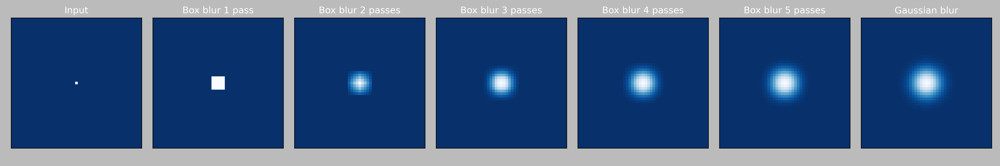
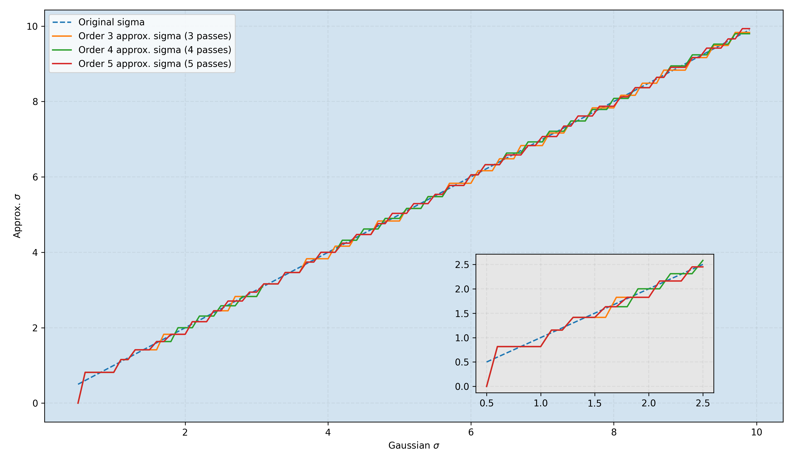

# Fast Gaussian Blur

Header only C++ implementation of a fast gaussian blur approximation in linear time. It is based on a blog post by Ivan Kutskir: [blog](http://blog.ivank.net/fastest-gaussian-blur.html). Which refers to a presentation by Wojciech Jarosz: [slides](http://elynxsdk.free.fr/ext-docs/Blur/Fast_box_blur.pdf). Which itself describes an algorithm from the paper **Fast Almost-Gaussian Filtering** by Peter Kovesi: [site](https://www.peterkovesi.com/matlabfns/#integral), [paper](https://www.peterkovesi.com/papers/FastGaussianSmoothing.pdf).
The demo code uses STB_IMAGE and STB_IMAGE_WRITE by [stb](https://github.com/nothings/stb) for image manipulation. 

## Implementation

The implementation is defined in the `fast_gaussian_blur_template.h` header that contains the fastest templated cache coherent version I could make.
The main exposed function and its arguments are:
```c++
template<typename T>
void fast_gaussian_blur(
    T *& in,             //! ref to source buffer ptr
    T *& out,            //! ref to target buffer ptr
    const int w,         //! image width
    const int h,         //! image height
    const int c,         //! image channels (currently supports up to 4)
    const float sigma,   //! Gaussian std deviation
    const uint32_t n,    //! number of box filter passes (currently supports up to 10)
    const Border p       //! image border handling (one of: kExtend, kMirror, kKernelCrop, kWrap)
);

```
Note that the number of supported channels or passes can be easily extended by adding the corresponding lines in the template dispatcher functions.
<!-- where the arguments are:
- `in` is a reference to the source buffer ptr, 
- `out` is a reference to the target buffer ptr, 
- `w` is the image width, 
- `h` is the image height, 
- `c` is the image number of channels, 
- `sigma` is the desired Gaussian standard deviation, 
- `n` is the number of box blur passes to perform.  -->
Note that the buffer values (input and output) and their pointers are modified during the process hence they can not be constant.

This version blurs 2000k pixels in ~7ms on all cores of a Ryzen 7 2700X CPU with OpenMP. 
Hence it may be used for real-time applications with reasonable image resolutions. 
A SIMD vectorized or a GPU version of this algorithm could be significantly faster (but may be painful for the developper for arbitrary channels number / data sizes). 

Note that I have tried to beat the template version with an ISPC compiled version, but still can not match the performance. 
If one manage to improve this version I would be pleased to discuss how :)

## Algorithm

The fast Gaussian blur algorithm in linear time is performed with several box blur passes over an image.
Applying several times box blur converges towards a true Gaussian blur thanks to the theorem central limit (cf. next image). 
Three passes are sufficient for good quality results but the exposed implementation supports arbitrary number of box blur passes.  



A 2D box blur is a separable convolution, hence it is most of the time performed using first an horizontal 1D box blur pass and then a vertical 1D box blur pass. Usually the process of N box blur passes should alternate between these horizontal and vertical passes. 
However thanks to box blur properties the horizontal and vertical passes can be performed in any order without changing the result.
Hence for performance purposes I came up with the following algorithm: 
1. apply N times horizontal box blur (horizontal passes)
2. flip the image buffer (transposition)
3. apply N times horizontal box blur (vertical passes)
4. flip the image buffer (transposition)

Steps 1. and 3. are performed with the `horizontal_blur` function, which is a fast 1D box blur pass with a sliding accumulator.
Steps 2. and 4. are performed with the `flip_block` function, which is a fast image buffer transposition, processed per block such that it better preserves cache coherency.

**Note 1:** The fast gaussian blur algorithm is not accurate on image boundaries. 
It performs a diffusion of the signal with several independant passes, each pass depending 
of the preceding one. Some of the diffused signal is lost near borders and results in a slight 
loss of accuracy for next pass. This problem can be solved by increasing the image support of 
half the box kernel extent at each pass of the algorithm. The added padding would in this case 
capture the diffusion and make the next pass accurate. 
On contrary true Gaussian blur does not suffer this problem since the whole diffusion process 
is performed in one pass only.
The extra padding is not performed in this implementation, however we provide several border
policies resulting in dfferent approximations and accuracies. 

**Note 2:** The fast gaussian blur algorithm does not reproduce accurately a true desired Gaussian standard deviation (sigma).
The approximate sigma oscillate around the true sigma and the error will be less noticeable as sigma increases.
In fact, this method is designed to resolve medium or high values of sigma super fast, and are not well suited for small sigmas (<=2), since a simple separable Gaussian blur implementation could be equally fast and of better quality.

  

For further details please refer to:
- http://blog.ivank.net/fastest-gaussian-blur.html
- https://www.peterkovesi.com/papers/FastGaussianSmoothing.pdf

## Demo application

In a Unix or WSL term you can use the provided makefile; use `make` to build the target `fastblur` example (main.cpp) without dependencies.
Run the program with the following command:

`./fastblur [input] [output] [sigma] [order - optional] [border - optional]`

- input:  extension should be any of [.jpg, .png, .bmp, .tga, .psd, .gif, .hdr, .pic, .pnm].
- output: extension should be any of [.png, .jpg, .bmp]. Unknown extensions will be saved as .png by default.
- sigma:  Gaussian standard deviation (float). Should be positive.
- order:  optional filter order [1: box, 2: bilinear, 3: biquadratic, 4. bicubic, ..., 10]. should be positive. Default is 3 and current implementation supports up to 10 box blur passes, but one can easily add more in the code.
- border: optional treatment of image boundaries [mirror, extend, crop, wrap]. Default is mirror.

## Results

The fast Gaussian blur is linear in time regarding the size of the input image, but independent of sigma hence sigma = 5 is equally fast as sigma = 50.
|Original|sigma = 2|sigma = 5|sigma = 10|sigma = 30|sigma = 50|
|:---:|:---:|:---:|:---:|:---:|:---:|
||||||

## Performance

The graph below shows the average exectution time of blur algorithm w.r.t pixel number on Ryzen 7 2700X. Compared to true Gaussian blur the approximate fast Gaussian blur results in a huge speedup. The original algorithm is described with 3 horizontal blur passes and 3 vertical blur passes (brown and red curves). But the column major traversal of large image buffer may result in cache incohenrency in the original vertical blur pass (see at the right of the dashed blue line). Instead, we can perform an image buffer transpositions and only cache coherent row major traversals (horizontal blur) to mitigate the problem (purple and green curves). Again, the transposition step is not a cache friendly operation thus on large image buffer we observe the slope w/ transpose slowly increasing w.r.t image size (more visible on the green curve). Performing the image transposition with fixed squared blocks per thread helps preserving the cache coherency and results in the fastest version of the algortihm (orange and blue curves). Further improved in the templated version exposed in the header (blue curve).

  

## Acknowledgments

Special thanks to Jean-Claude Iehl (@jciehl) for our insightful discussions and his passion for making code simple and fast. 

## Licence

You may use, distribute and modify this code under the terms of the MIT license. For further details please refer to : https://mit-license.org/

## Changelog

TODOs:
- [ ] add Kernel support to the `horizontal_blur_wrap` function
- [ ] add unit tests 
- [ ] redo timings
- [ ] make a single horizontal_blur function instead of 4 variants

v1.2
- remove `Index` structure in favor of the `remap_index` function
- add `round_v<T>()` function for better readability

v1.1
- bug fix for mid sized kernels. 
- added Kernel enum {kLarge, kMid, kSmall}.
- massive rework for extend, mirror and crop border policies with the above fix.
    - split each funcion in 3 modes for `kLarge` (radius >= width), `kMid` (radius < width) and `kSmall` (radius < width/2) kernel sizes.
    - introduce `template<typename T, int C, Kernel kernel> inline void horizontal_blur_mirror(...)`
    - introduce `template<typename T, int C, Kernel kernel> inline void horizontal_blur_extend(...)`
    - introduce `template<typename T, int C, Kernel kernel> inline void horizontal_blur_kernel_crop(...)`
    - remove `template<typename T, int C> inline void horizontal_blur_mirror_small_kernel(...)`
    - remove `template<typename T, int C> inline void horizontal_blur_mirror_large_kernel(...)`
    - remove `template<typename T, int C> inline void horizontal_blur_extend_small_kernel(...)`
    - remove `template<typename T, int C> inline void horizontal_blur_extend_large_kernel(...)`
    - remove `template<typename T, int C> inline void horizontal_blur_kernel_small_kernel(...)`
    - remove `template<typename T, int C> inline void horizontal_blur_kernel_large_kernel(...)`
    - deep testing of singular cases

v1.0
- make border policy a parameter
- add support for wrap and mirror (without repetition) border policies
    - add `horizontal_blur_mirror_small_kernel`
    - add `horizontal_blur_mirror_large_kernel`
    - add `horizontal_blur_wrap_small_kernel`
    - add `horizontal_blur_wrap_large_kernel`
- faster kernel crop policy for small kernels
    - add `horizontal_blur_kernel_crop_small_kernel`
    - add `horizontal_blur_kernel_crop_large_kernel`
- minor fixes

## References

- [Recursive gaussian filters](https://software.intel.com/content/dam/develop/external/us/en/documents/cwp546-181134.pdf)
- [Fast O(1) bilateral filtering using trigonometric range kernels](http://bigwww.epfl.ch/chaudhury/Fast%20bilateral%20filtering.pdf)
- [A Survey of Gaussian Convolution Algorithms](http://www.ipol.im/pub/art/2013/87/)
- [Filtering by repeated integration](http://citeseerx.ist.psu.edu/viewdoc/summary?doi=10.1.1.72.4795)
- [Fast Filter Spreading and its Applications](https://www2.eecs.berkeley.edu/Pubs/TechRpts/2009/EECS-2009-54.pdf)
- [Fast Almost-Gaussian Filtering](https://www.peterkovesi.com/papers/FastGaussianSmoothing.pdf)
- [Fast image convolutions](http://elynxsdk.free.fr/ext-docs/Blur/Fast_box_blur.pdf)
