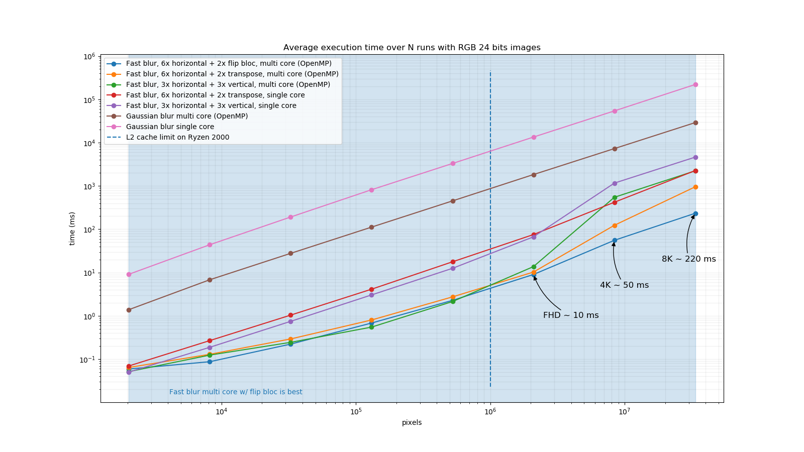

# Fast Gaussian Blur

C++ implementation of a fast gaussian blur approximation in linear time. It is based on a blog post by Ivan Kutskir: [blog](http://blog.ivank.net/fastest-gaussian-blur.html). Which refers to a presentation by Wojciech Jarosz: [slides](http://elynxsdk.free.fr/ext-docs/Blur/Fast_box_blur.pdf). Which itself describes an algorithm from the paper **Fast Almost-Gaussian Filtering** by Peter Kovesi: [site](https://www.peterkovesi.com/matlabfns/#integral), [paper](https://www.peterkovesi.com/papers/FastGaussianSmoothing.pdf). The code uses STB_IMAGE and STB_IMAGE_WRITE by stb for image manipulation: [stb github](https://github.com/nothings/stb). 

## Details

The fast Gaussian blur algorithm in linear time is performed with several box blur passes over an image.
Applying several times box blur converges towards a true Gaussian blur thanks to the theorem central limit. 
Three passes are sufficient for good quality results but the exposed implementation supports arbitrary number of box blur passes. 
Usually the process of N passes should alternate between horizontal and vertical passes as much times as we want box blur passes. However thanks to box blur properties the separable horizontal and vertical passes can be performed in any order without changing the result.
Hence for performance purposes the algorithm is: 
1. apply N times horizontal blur (horizontal passes)
2. flip the image buffer (transposition)
3. apply N times horizontal blur (vertical passes)
4. flip the image buffer (transposition)

**Note:** The fast gaussian blur algorithm is not accurate on image boundaries. 
It performs a diffusion of the signal with several independant passes, each pass depending 
of the preceding one. Some of the diffused signal is lost near borders and results in a slight 
loss of accuracy for next pass. This problem can be solved by increasing the image support of 
half the box kernel extent at each pass of the algorithm. The added padding would in this case 
capture the diffusion and make the next pass accurate. 
On contrary true Gaussian blur does not suffer this problem since the whole diffusion process 
is performed in one pass only.
The extra padding is not performed in this implementation, however we provide and discuss several border
policies resulting in dfferent approximations and accuracies.  

For further details please refer to:
- http://blog.ivank.net/fastest-gaussian-blur.html
- https://www.peterkovesi.com/papers/FastGaussianSmoothing.pdf

## Details

The implementation is defined in the `fast_gaussian_blur_template.h` header that contains the fastest templated cache coherent version I could make.
The main exposed function is defined as:
```c++
template<typename T>
void fast_gaussian_blur(T *& in, T *& out, const int w, const int h, const int c, const float sigma, const unsigned int n);
```
where `in` is the source buffer reference ptr, `out` is the target buffer reference ptr, `w` is the image width, `h` is the image height, `c` is the image number of channels, and `sigma` is the desiredGaussian standard deviation.

This version blurs 2000k pixels in ~7ms on all cores of a Ryzen 7 2700X CPU with OpenMP. 
Hence it may be used for real-time applications with reasonable image resolutions. 
A SIMD vectorized or a GPU version of this algorithm could be significantly faster (but may be painful for the developper for arbitrary channels number / data sizes). 
Note that I have tried to beat the template version with an ISPC compiled version, but still can not match the performance. 
If one manage to improve this version I would be pleased to discuss how :)

## Compilation

In a Unix or WSL term you can use the provided makefile; use `make` to build the target `fastblur` example (main.cpp) without dependencies.

## Usage

Run the program with the following command:

`./fastblur <input_filename> <output_filename> <sigma> <passes = 3>`

- input_image_filename should be any of [.jpg, .png, .bmp, .tga, .psd, .gif, .hdr, .pic, .pnm].
- output_image_filename should be any of [.png, .jpg, .bmp]  (unknown extensions will be saved as .png by default).
- sigma is the desired Gaussian blur standard deviation (should be positive).
- passes is an optional argument that controls the number of box blur passes (should be positive). Default is 3 and current implementation supports up to 10 passes, but one can easily add more in the code.

## Results

The fast Gaussian blur is linear in time regarding the size of the input image, but independent of sigma hence sigma = 5 is equally fast as sigma = 50.
|Original|sigma = 2|sigma = 5|sigma = 10|sigma = 30|sigma = 50|
|:---:|:---:|:---:|:---:|:---:|:---:|
||||||

## Performance

The graph below shows the average exectution time of blur algorithm w.r.t pixel number on Ryzen 7 2700X. The dashed blue line highlights the fact that column major traversal of large image buffer may result in cache incohenrency. Hence we can perform image buffer transpositions and only cache coherent row major traversals to mitigate the problem. However the transposition step is not a cache friendly operation thus on large image buffer we observe the slope w/ transpose slowly increasing w.r.t image size. Performing the image transposition with fixed squared blocks per thread helps preserving the cache coherency and results in the fastest version of the algortihm (flip bloc). 

  

## Acknowledgments

Special thanks to Jean-Claude Iehl (@jciehl) for our insightful discussions and his passion for making code simple and fast. 

## Licence

You may use, distribute and modify this code under the terms of the MIT license. For further details please refer to : https://mit-license.org/

## References

- [Recursive gaussian filters](https://software.intel.com/content/dam/develop/external/us/en/documents/cwp546-181134.pdf)
- [Fast O(1) bilateral filtering using trigonometric range kernels](http://bigwww.epfl.ch/chaudhury/Fast%20bilateral%20filtering.pdf)
- [A Survey of Gaussian Convolution Algorithms](http://www.ipol.im/pub/art/2013/87/)
- [Filtering by repeated integration](http://citeseerx.ist.psu.edu/viewdoc/summary?doi=10.1.1.72.4795)
- [Fast Filter Spreading and its Applications](https://www2.eecs.berkeley.edu/Pubs/TechRpts/2009/EECS-2009-54.pdf)
- [Fast Almost-Gaussian Filtering](https://www.peterkovesi.com/papers/FastGaussianSmoothing.pdf)
- [Fast image convolutions](http://elynxsdk.free.fr/ext-docs/Blur/Fast_box_blur.pdf)
